# 玖物单机智诊系统使用说明

> **撰写人**：软件算法部-规划控制组-黄振炎
> **日期**：2026-07-28
>
> 本文是玖物单机智诊系统的统一使用说明，覆盖售后、研发、管理员三种登录角色及日常运维操作。原 `user-guide.md`（现场一页纸指南）与 `replay-user-manual.md`（回放工具详解）已废弃，内容均已并入本文。

---

## 目录

1. [系统简介](#1-系统简介)
2. [通用操作（所有角色）](#2-通用操作所有角色)
3. [售后人员指南](#3-售后人员指南)
4. [研发人员指南](#4-研发人员指南)
5. [管理员指南](#5-管理员指南)
6. [运维精简指南](#6-运维精简指南)
7. [附录 A：工单状态对照表](#附录-a工单状态对照表)
8. [附录 B：术语表](#附录-b术语表)

---

## 1. 系统简介

### 1.1 系统定位

玖物单机智诊系统是叉车售后问题的工单管理与日志智能诊断平台。核心流程：

**售后建单并上传车端日志 → 系统自动分析日志、匹配知识库规则 → 生成排查向导 → 售后按向导现场排查 → 解决则自助关单，解决不了升级研发 → 研发认领处理、给出解决方案 → 排查经验沉淀回知识库**。

系统随迭代不断沉淀知识规则，让越来越多的问题在现场环节就能自助解决。

### 1.2 角色与权限

系统有三种登录角色，权限边界如下：

| 功能 | 售后（after_sales） | 研发（rd） | 管理员（admin） |
|------|:---:|:---:|:---:|
| 查看工单 | 仅自己提交的 | 全部（可按提单人筛选） | 全部 |
| 新建工单 / 上传日志 | ✓ | ✗ | ✓ |
| 执行排查步骤 / 自助解决 / 升级研发 / 取消工单 | ✓（自己的工单） | ✗ | ✓ |
| 认领工单 / 标记已解决 / 修改问题类型 | ✗ | ✓ | ✓ |
| 日志诊断回放（/replay） | ✗ | ✓ | ✓ |
| 知识库管理 | ✗ | ✓ | ✓ |
| 现场管理 / 车型管理 / 数据统计 | ✗ | ✓ | ✓ |
| 用户管理 | ✗ | ✗ | ✓ |
| 删除工单 | ✗ | ✗ | ✓ |

> 注意两个容易误解的点：
> - **研发不能建单**，也不能执行排查步骤——建单、排查是售后（和管理员）的动作；研发通过"待研发介入"的升级工单接入。
> - **管理员同时具备售后与研发的全部操作能力**，第 3、4 章的所有操作对管理员同样适用。

### 1.3 工单状态流转

```text
待分析 → 分析中 → 待现场排查 → 现场排查中 ─┬→ 已自助解决
   ↑（分析失败回退）                        │
                                            └→ 待研发介入 → 研发处理中 → 已解决

任一未终结状态下，提单人可将工单置为：已取消
```

各状态含义见[附录 A](#附录-a工单状态对照表)。

---

## 2. 通用操作（所有角色）

### 2.1 登录

1. 浏览器访问系统地址（如 `http://<服务器IP>:8091`）。
2. 输入账号密码，点击「登录」。
3. 账号密码由系统管理员统一分配；忘记密码请联系管理员在「用户管理」中重置。

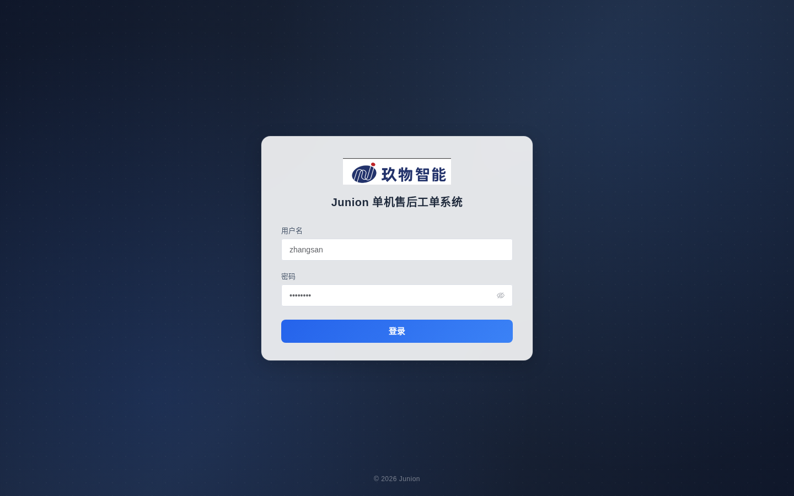

登录后默认进入「工单管理」列表页。左侧菜单按角色显示可用功能：售后只有「工单管理」；研发多出「日志诊断」「现场管理」「车型管理」「数据统计」；管理员再多出「用户管理」。

### 2.2 退出与会话

- 点击右上角「退出」注销登录。
- 登录凭证（JWT）过期后会自动跳回登录页，重新登录即可。
- 修改密码、重置密码由管理员在「用户管理」中操作（见 [5.1](#51-用户管理)）。

---

## 3. 售后人员指南

售后的日常工作围绕一张工单展开：建单 → 等分析 → 按向导排查 → 关单或升级。

### 3.1 工单列表

登录后进入工单列表，支持按**状态、现场、问题类型、车型**筛选，默认按创建时间倒序、每页 20 条。点击工单号或「查看」进入详情。

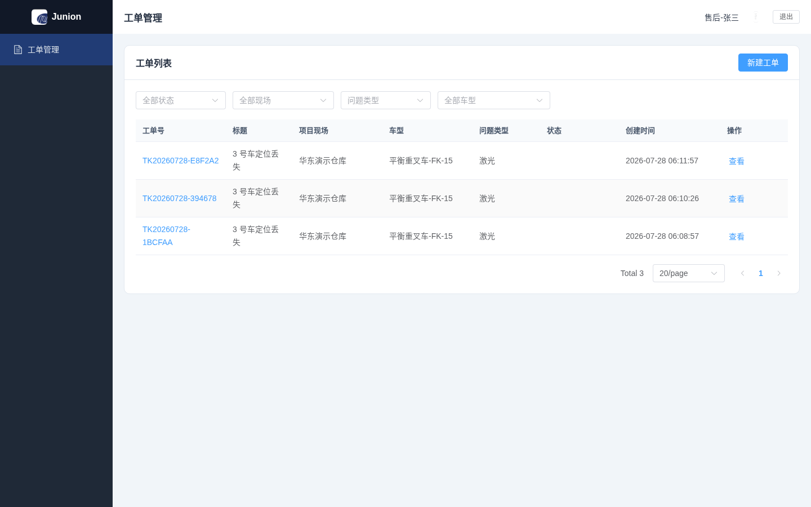

> 售后只能看到自己提交的工单。

### 3.2 新建工单

点击列表右上角「新建工单」：

1. **标题**：一句话概括问题，如「3 号车定位丢失」。
2. **项目现场**：选择事发车辆所属现场（现场由研发/管理员预先配置）。
3. **车型**：选择该现场关联的车型；若下拉为空提示"该现场未关联车型"，请联系管理员配置。
4. **问题描述**：补充现象、发生时间、影响范围，写得越具体，自动分析越准。
5. **发生时间 / 影响程度**：可选。
6. **上传文件**：选择车端导出的日志。支持 `.log`、`.zip`、`.tar.gz`，**单个文件不超过 50MB，总大小不超过 200MB**；压缩包会自动解压，自动识别其中的 `.log` 日志与 `.json` 地图。
7. **AI 介入分析**：默认开启，会调用大模型基于日志上下文生成 AI 分析结论，耗时较长；仅需规则匹配时可关闭。
8. 点击「提交工单」。

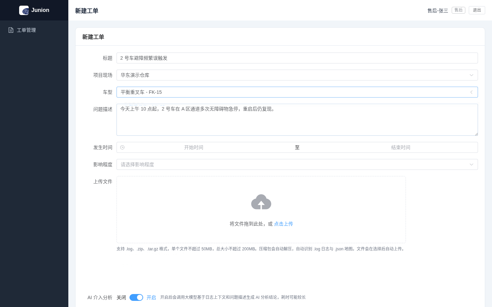

提交后自动进入工单详情页，状态为「分析中」。分析通常几十秒内完成（超时上限 10 分钟），完成后状态变为「待现场排查」。

### 3.3 阅读分析结果与排查向导

分析完成后，详情页从上到下依次是：**结论摘要**（自动分析结论、置信度）、**排查向导**、**当前分析版本**（Top 问题）、**AI 分析结论**（若开启）、**操作按钮区**、**精简证据**、**关键时间线**、**事件流**。


排查向导按优先级列出命中的排查路径（最多 Top 3），每条路径展示置信度和编号步骤。步骤标签含义：

- **关键**：该步骤是判断问题的关键节点，不能跳过。
- **只读检查**：只需观察确认，不动车。
- **现场操作**：需要对车辆或环境实际操作，执行前有安全确认。

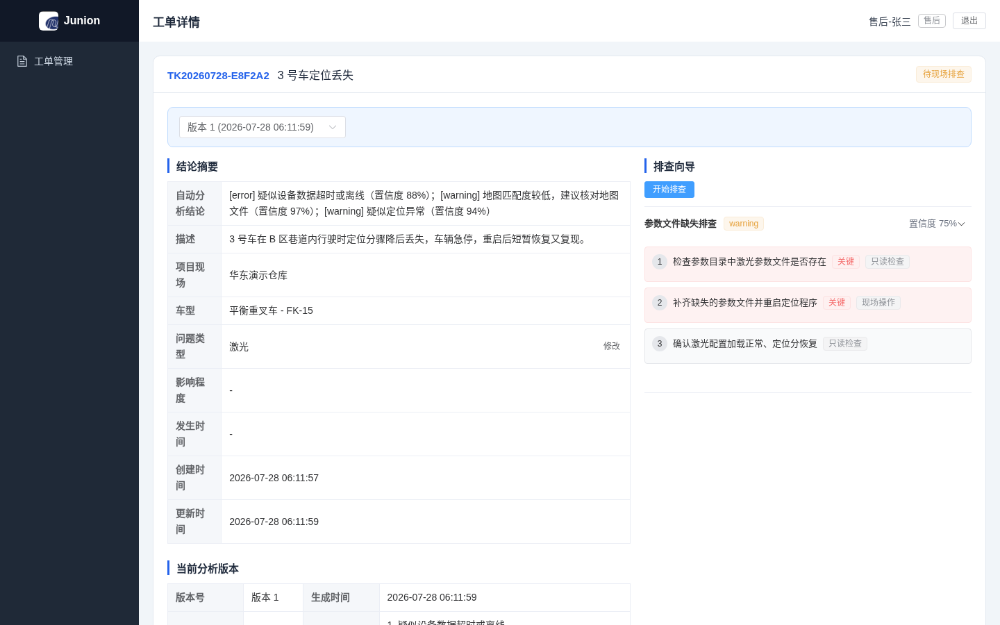

> 若显示"未匹配到已验证规则"，说明日志未命中知识库，可补充上传更多日志重试，或直接升级研发。

### 3.4 执行排查步骤

点击「开始排查」，状态变为「现场排查中」，随后逐步执行向导并记录结果。每一步有四种状态：

| 状态 | 含义 |
|------|------|
| 未检查 | 尚未执行（默认） |
| 已通过 | 已确认该项无问题 |
| 未通过 | 该项发现问题，按提示继续处理 |
| 不适用 | 本场景无法执行，**必须选择原因**（如工具不可用、缺少权限等） |

首次将「现场操作」类步骤标记为已通过/未通过时，会弹出**安全确认**——务必确认车辆已停止或处于安全模式后再点「已确认安全」：

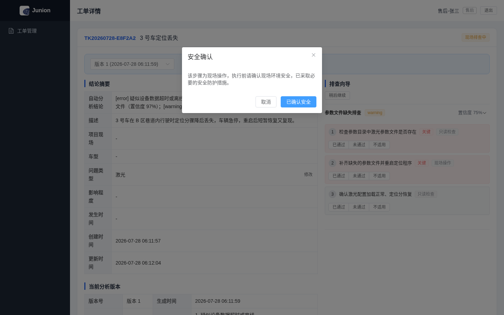

选择「不适用」时需要选择原因后提交：

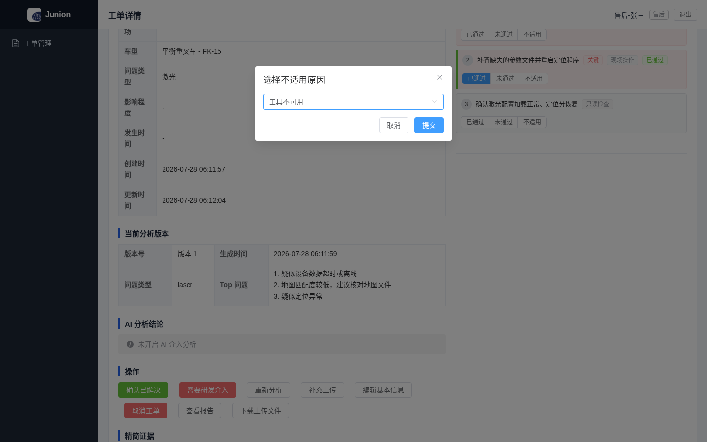

每次状态变更都会自动记录操作人和时间戳，写入事件流。

### 3.5 自助解决或升级研发

- **问题已解决**：点击「确认已解决」，工单进入「已自助解决」。
- **排查完仍未解决**，或缺少权限/工具：点击「需要研发介入」，选择升级原因后提交，状态变为「待研发介入」，系统自动通知研发。

升级原因共六种：按向导排查仍未解决、缺少权限或工具、疑似软件缺陷、诊断结论不可信、需要远程协助、其他。

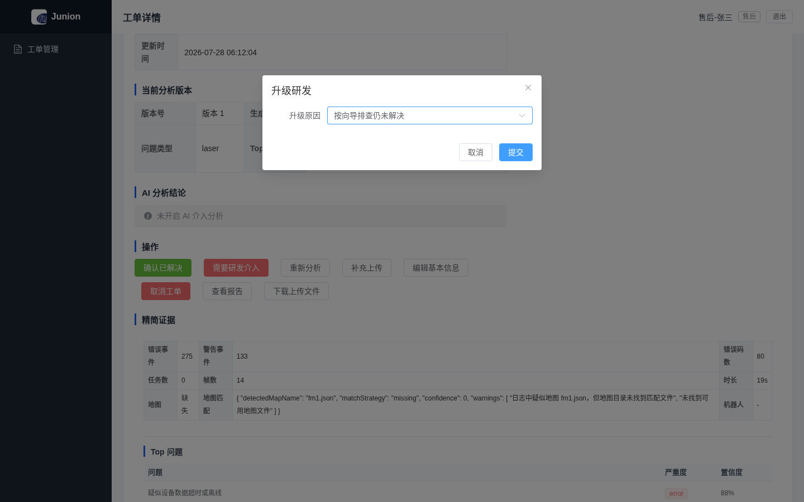

### 3.6 其他常用操作

- **发表评论**：详情页底部评论框，用于补充现场信息、与研发沟通，评论进入事件流。
- **补充上传**：追加日志文件，可勾选"上传后重新分析"让系统基于新日志重新生成分析版本。
- **编辑基本信息**：工单未终结前可修改标题、描述。
- **取消工单**：误提交时提单人可取消，取消后不可再编辑或操作。
- **查看报告 / 下载上传文件**：查看本次分析的完整报告，或下载工单内全部日志。

事件流完整记录了工单从创建到关闭的每一步（创建、分析开始/完成、步骤变更、评论、升级、解决等），是追溯的第一手材料：

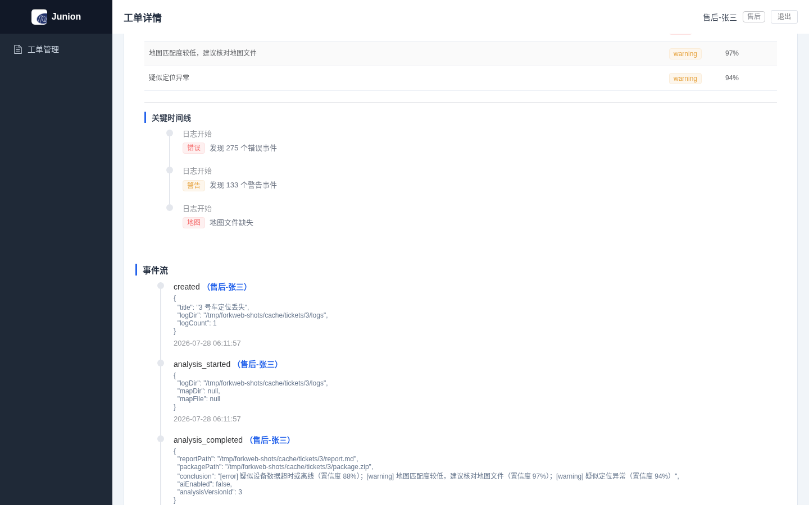

### 3.7 常见问题

| 问题 | 处理建议 |
|------|----------|
| 状态卡在「分析中」 | 耐心等待，分析超时上限 10 分钟；超时后状态回退为「待分析」并记录事件，可重新触发分析。 |
| 排查向导显示"未匹配到已验证规则" | 日志未命中知识库，补充上传更多日志后重试，或升级研发。 |
| 误提交工单 | 提单人点击「取消工单」。 |
| 需要改标题/描述 | 未终结前点击「编辑基本信息」。 |
| 上传报"总大小不能超过 200MB" | 拆分日志分批上传，或剔除无关文件。 |

**安全提示**：执行现场操作前务必确认车辆已停止或处于安全模式；无法判断时优先升级研发，不要强行操作；不要外传自己的系统账号密码。

---

## 4. 研发人员指南

研发的两大工作面：**处理售后升级上来的工单**，以及使用**日志诊断回放工具**做深度分析并把经验沉淀进知识库。

### 4.1 处理升级工单

工单列表中筛选「待研发介入」状态，进入详情：

1. **认领工单**：点击「认领工单」，状态变为「研发处理中」，工单指派给自己。

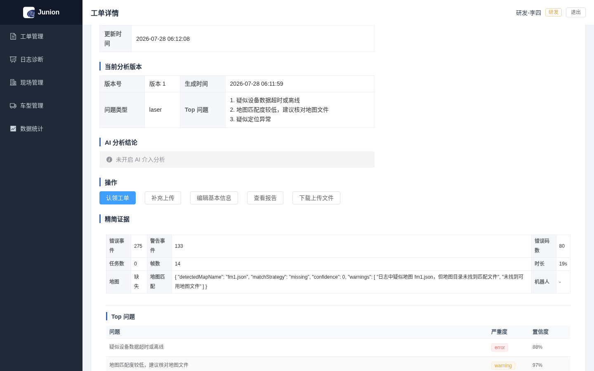

2. **分析处理**：可使用「补充上传」「重新分析」「查看报告」「下载上传文件」，也可以在 `/replay` 页面用「从工单导入」直接加载该工单的日志做深度诊断（见 4.2）。
3. **标记已解决**：处理完成后点击「标记已解决」，填写解决方案，状态变为「已解决」。解决方案会展示给售后，请写清楚根因与处理办法。

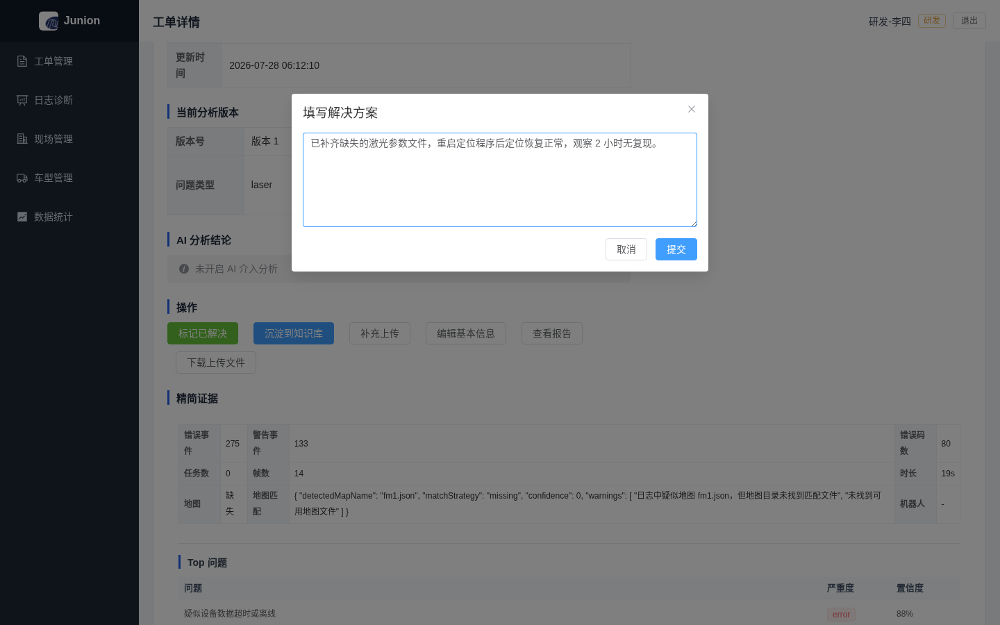

4. **沉淀到知识库**：解决后建议点击「沉淀到知识库」，把本次排查转化为知识规则（系统也会在解决时提示）。规则被验证后，下次同类问题售后就能靠排查向导自助解决。
5. **修改问题类型**：自动分类不准时，点击结论摘要中问题类型旁的「修改」人工修正，修正会同步用于列表筛选和统计。

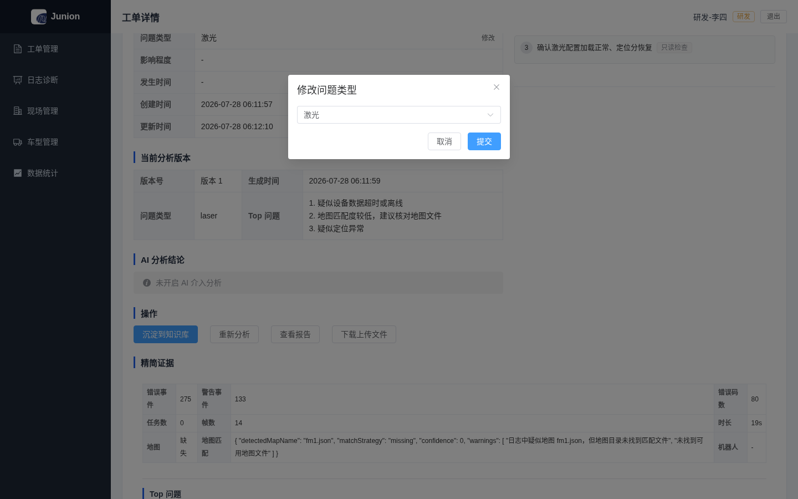

6. **分析版本管理**：每次重新分析生成一个新版本，详情页顶部可切换版本、点击「对比差异」查看两次分析的差异。

### 4.2 日志诊断回放工具（/replay）

左侧菜单「日志诊断」进入 `/replay` 页面。它把日志、地图、任务、错误码、原始日志上下文放在同一页面做离线诊断与轨迹回放，适合：从车上拷回日志离线排查、复现售后诊断包、导出报告归档。

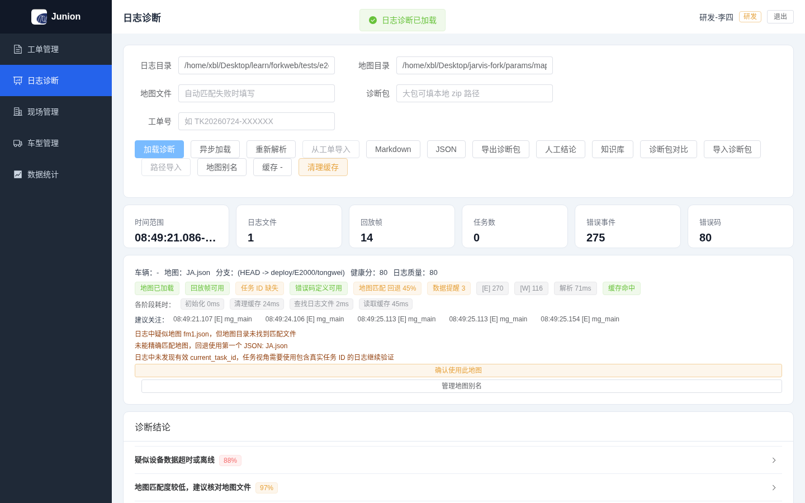

#### 加载数据

顶部配置区四种加载方式，任选其一：

- **日志目录 + 地图目录**：填服务器本机路径，点「加载诊断」；自动匹配地图不对时在「地图文件」里填具体 JSON 路径（优先级最高）。
- **从工单导入**：填工单号（如 `TK20260724-XXXXXX`），直接加载该工单上传的日志。
- **导入诊断包**：读取他人导出的 zip 诊断包，无需连实车、无需本机有同名地图。
- **路径导入**：诊断包较大时填本机 zip 完整路径导入，避免浏览器读大文件。

日志很大时用「异步加载」，页面显示解析阶段与百分比。日志或地图文件改动后用「重新解析」跳过缓存。

#### 一键概览

加载完成后先看概览，判断这批日志值不值得看、问题在哪：

- **基础统计**：时间范围、日志文件数、回放帧数、任务数、错误事件数、错误码数。
- **数据完整性**：是否有地图 / 可回放帧 / 任务 ID / 错误码定义。没有可回放帧时优先检查日志目录是否选错。
- **健康分与日志质量分**：综合判断日志完整度；**建议关注时间**点击即可跳转。
- **地图匹配**：显示匹配策略与置信度。置信度低时先确认地图；确认无误可点「确认使用此地图」保存**地图别名**，之后同名日志自动匹配。
- **Top 问题**：最值得先看的异常（高等级错误码、关键 `[E]`/`[W]`、任务失败、低定位分、急停/lost 等），点击联动跳转。

#### 诊断结论与时间线

- **诊断结论**：给出候选根因（标题、置信度、证据、处理建议），来自内置规则与知识库；命中知识库的会打「知识库命中」标签。每条支持跳转证据、复制证据包、加书签、转为知识，以及「有用/误报」反馈。
- **问题时间线**：按时间串起启动、任务变化、错误码、状态变化、低定位分等关键事件；支持按类型/严重度/时间筛选、重复合并、噪声折叠。点击事件会联动地图回放跳时间、原始日志刷上下文——**"时间线事件 → 地图位置 → 原始日志上下文"是最常用的排查路径**。

#### 地图回放

回放区回答"车什么时候在哪里、在干什么、附近发生了什么"：

- 播放/暂停、倍速、视频式进度条拖动；进度条上的 marker 表示关键事件，点击跳转。
- 「上一问题/下一问题」在异常点间跳转；「设起点/设终点 + 循环」反复播放某段；「遇问题暂停」在错误、急停、低定位分附近自动停。
- 地图上可点击轨迹点、事件点查看该时刻位置、状态、任务、错误。

#### 错误码中心与任务视角

- **错误码中心**：集中查看 `ERRORxxxx` 及人工字典错误码，含内容、屏幕显示、排除方法、等级、发生次数与发生点；人工字典（`replay-server/config/manual-error-dictionary.json`）优先级最高。
- **任务视角**：按任务段查看开始/结束时间、成功失败、未完成路径、关联错误码，适合排查"某个任务为什么失败"。

#### 原始日志与过滤

支持按级别、模块、关键词（多关键词逗号分隔，如 `ERROR,task,lost`）、错误码、任务、时间过滤；「当前时间上下文」围绕回放时刻展示前后日志。**转交问题时请复制异常前后的上下文片段，不要只复制一行报错**。

#### 报告与诊断包

- **Markdown / JSON 报告**：Markdown 适合人读与归档，JSON 适合程序处理，内容含结论、根因、错误码分组、任务摘要、时间线。
- **导出诊断包**：zip 包含日志、地图、报告、别名与反馈摘要，是转交问题的推荐载体；导出时可选时间范围与包含项。
- **诊断包对比**：对比两个包的车辆、地图、错误规模变化，快速判断是否同一问题。
- **人工结论**：转交前点「人工结论」填写现场、车辆、测试人员、已确认根因等，会写入报告与包 manifest。

#### 问诊助手（可选）

「问诊助手」Tab 基于当前诊断结果与知识库做辅助问答。未配置大模型时为离线模式（仅本地相似检索与离线建议）；在「配置模型」中填入 DeepSeek 或 OpenAI 兼容接口的 API Key 后可在线问答。提问只上传受限上下文（可先点「上下文预览」确认），不上传全量日志。AI 回答可「转为知识」草稿，但保存前必须人工确认根因与规则宽度。

### 4.3 知识库管理

入口：`/replay` 页面顶部「知识库」按钮。

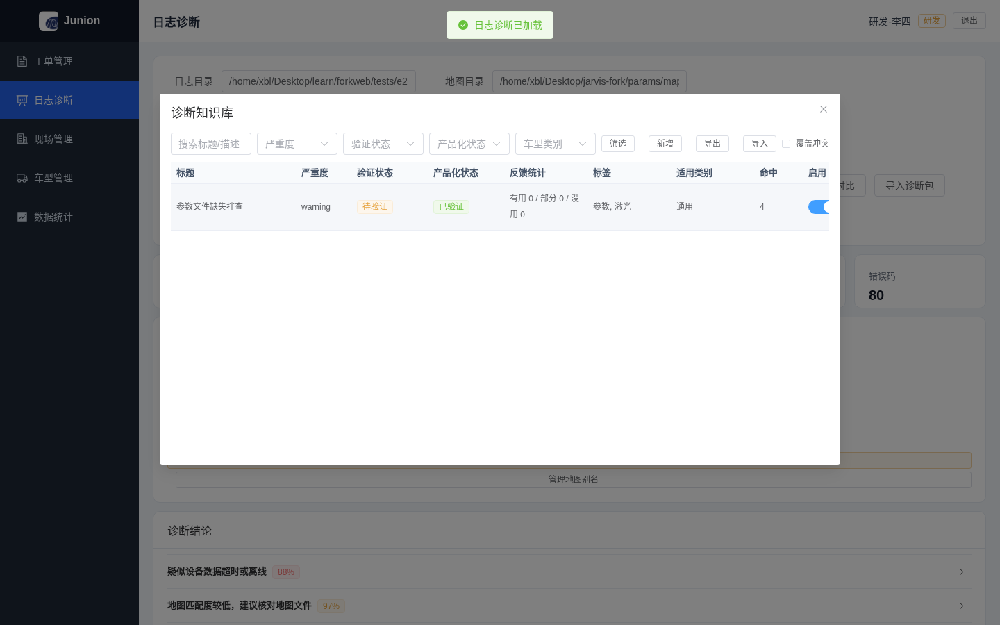

- **沉淀入口**：工单详情「沉淀到知识库」；`/replay` 中时间线事件、错误码发生点、诊断结论的「沉淀知识/转为知识」；或知识库弹窗直接「新增」。
- **规则内容**：标题、描述、根因、处理办法、严重度、标签，以及匹配规则（必选词、任意词、排除词、模块、错误码、时间窗口、次数阈值）。可「自动提取规则」，保存前建议「试跑」确认能命中当前日志。
- **产品化状态**：草稿（draft）→ 已验证（verified）。**只有已验证且启用的规则才会生成售后侧的排查向导**，请谨慎验证，规则过宽会误报。
- **维护操作**：搜索、编辑、复制、删除、启用/停用、导入/导出 JSON、按状态筛选、查看命中次数与反馈统计。

### 4.4 现场管理与车型管理

- **现场管理**（`/sites`）：维护项目现场列表，并为每个现场**关联车型**——售后建单时只能选到已关联的车型。已被工单引用的现场无法删除。

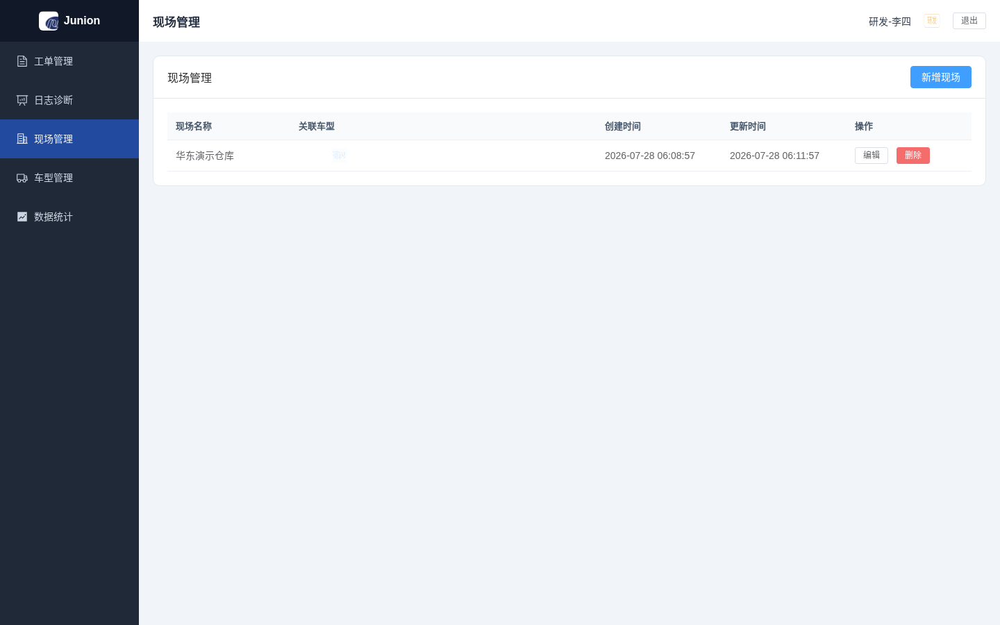

- **车型管理**（`/vehicles`）：先建车型类别（如"平衡重叉车"），再在类别下建型号（如"FK-15"）。

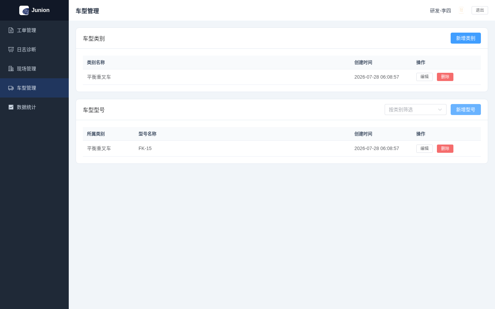

### 4.5 数据统计

「数据统计」（`/stats`）提供三块看板，支持按日期范围过滤：

- **工单统计**：总数、自助解决率、平均解决耗时，以及按状态/现场/问题类型/车型分布。
- **知识库统计**：规则总数、已验证数、覆盖率、命中次数排行、反馈分布。
- **人员统计**：售后提单量排行、研发解决量排行。

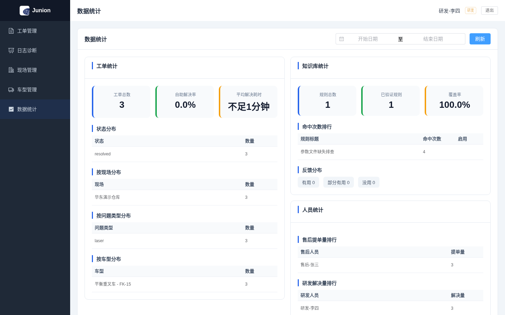

**自助解决率和知识库覆盖率是系统价值的核心指标**——覆盖率上不去，说明知识沉淀跟不上现场问题。

---

## 5. 管理员指南

管理员具备售后与研发的全部能力（见第 3、4 章），此外独有以下两项。

### 5.1 用户管理

左侧菜单「用户管理」（`/users`）：

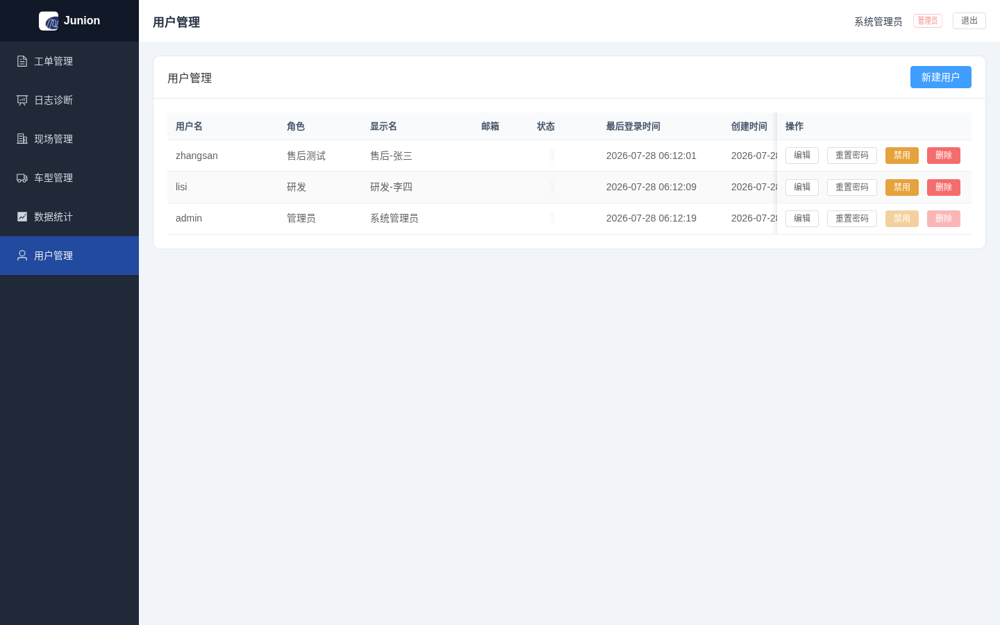

- **新建用户**：填用户名、密码、角色（售后/研发/管理员）、显示名、邮箱。
- **编辑**：修改角色、显示名、邮箱。
- **重置密码**：为忘记密码的用户设置新密码。
- **禁用/启用**：禁用后该账号无法登录，但历史记录保留。
- **删除**：彻底删除账号。

> 保护机制：系统不允许降级、禁用或删除**最后一个管理员**，避免管理入口丢失。

### 5.2 删除工单

管理员是唯一可以**硬删除**工单的角色（工单详情内操作）。删除不可恢复，仅用于清理测试数据等场景；正常业务请用「取消工单」代替。

---

## 6. 运维精简指南

本章只列日常操作，完整部署细节（Nginx、HTTPS、回退策略、上线检查清单）见 [`docs/deployment.md`](deployment.md)。

### 6.1 部署与更新

```bash
# 首次部署（默认监听宿主机 8091）
docker compose up -d --build

# 日常更新：自动备份数据库 → git pull → 重建镜像 → 重启
./scripts/update.sh
```

### 6.2 数据与备份

- 全部数据在 `./data` 目录：`data/cache`（SQLite 数据库、上传日志）、`data/config`（知识库、配置）。**切勿删除**。
- `update.sh` 每次更新自动备份数据库到 `data/backups/forkweb.db.bak.<时间戳>`；建议将该目录定期同步到异地。
- 数据库损坏时：复制最近备份覆盖 `data/cache/forkweb.db` 后 `docker compose restart`。

### 6.3 健康检查与告警

```bash
curl http://localhost:8091/api/health
```

外部持续监控（每 5 分钟探测，连续失败发企业微信告警）：

```bash
WECHAT_WORK_WEBHOOK_URL=https://qyapi.weixin.qq.com/cgi-bin/webhook/send?key=xxx \
  ./scripts/health-check.sh &
```

查看服务日志：`docker compose logs -f`。

### 6.4 关键环境变量

| 变量 | 说明 |
|------|------|
| `JWT_SECRET` | 登录凭证签名密钥，**生产环境必须改为强随机串** |
| `FORKWEB_ADMIN_PASSWORD` | 初始管理员密码（生产环境务必设置强密码，并在首次登录后修改） |
| `REPLAY_PORT` / `REPLAY_HOST` | 服务监听端口与地址 |
| `FORKWEB_CACHE_DIR` / `FORKWEB_CONFIG_DIR` | 数据与配置目录 |
| `WECHAT_WORK_WEBHOOK_URL` | 健康告警企业微信 Webhook |

### 6.5 知识库预填充

首次上线建议导入内置的常见问题规则（脚本幂等，可重复执行）：

```bash
docker compose exec forkweb npx tsx replay-server/scripts/seed-knowledge.ts
```

---

## 附录 A：工单状态对照表

| 状态 | 含义 | 谁触发 |
|------|------|--------|
| 待分析 | 工单已创建，分析未开始或分析失败回退 | 建单 / 分析失败 |
| 分析中 | 后台正在解析日志、匹配规则（超时 10 分钟） | 系统 |
| 待现场排查 | 分析完成，排查向导已生成 | 系统 |
| 现场排查中 | 售后点击「开始排查」后 | 售后 |
| 已自助解决 | 售后按向导解决并「确认已解决」 | 售后 |
| 待研发介入 | 售后「需要研发介入」升级 | 售后 |
| 研发处理中 | 研发「认领工单」后 | 研发 |
| 已解决 | 研发「标记已解决」并填写解决方案 | 研发 |
| 已取消 | 提单人取消，不可再操作 | 提单人 |

## 附录 B：术语表

| 术语 | 含义 |
|------|------|
| 定位分 | 车辆定位置信度评分，骤降或过低通常意味着定位异常 |
| 排查向导 | 分析命中已验证知识规则后生成的分步排查路径（最多 Top 3） |
| 知识规则 | 沉淀的排查经验：问题特征匹配规则 + 根因 + 处理办法 + 排查步骤 |
| 产品化状态 | 知识规则的成熟度：草稿 → 已验证；仅已验证规则对售后生效 |
| 诊断包 | `/replay` 导出的 zip，含日志、地图、报告、别名，用于离线复现 |
| 地图别名 | "日志中的地图名 ↔ 本机地图文件"的映射关系，用于自动匹配 |
| 分析版本 | 每次（重新）分析生成一个版本，可切换与对比差异 |
| 事件流 | 工单全生命周期的操作审计记录 |
| 错误码字典 | `ERRORxxxx` 的人工维护释义库，优先级高于自动解析 |
